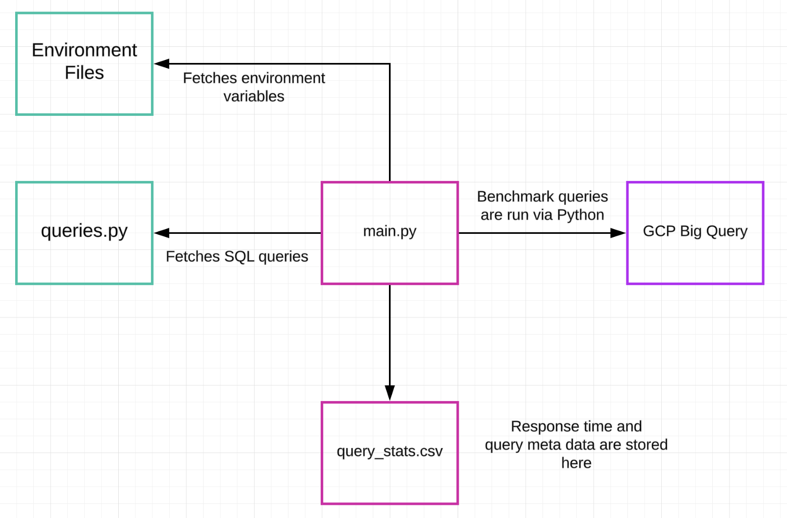
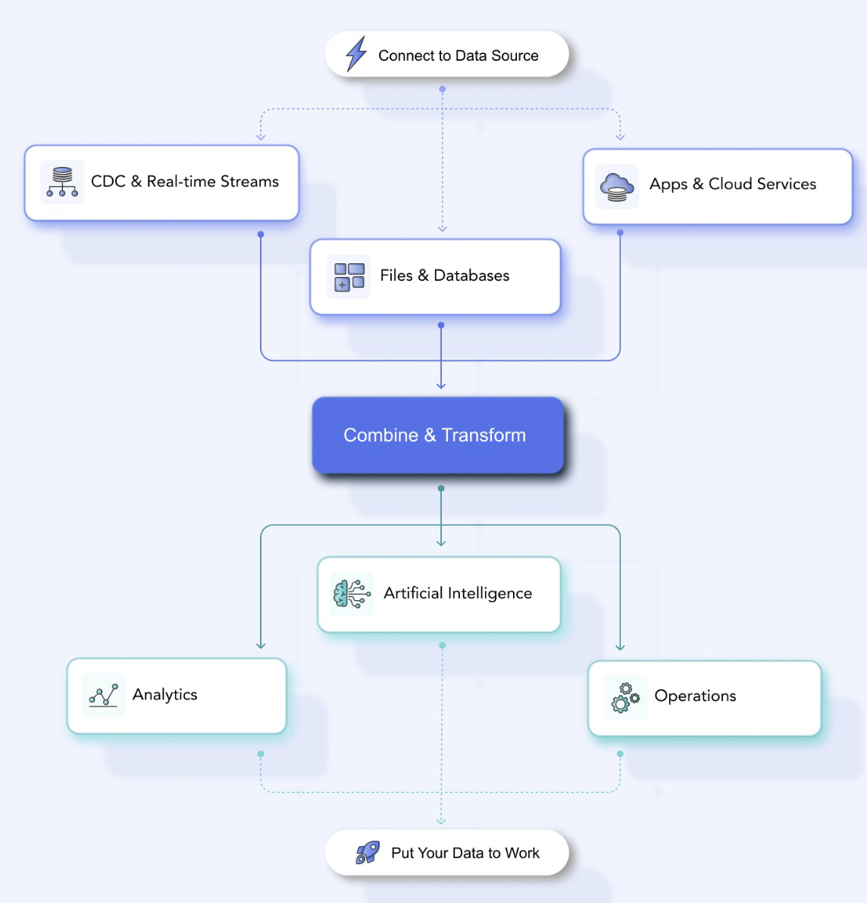

# **Estuary Benchmark Report**

👉 Check out the full report here: https://estuary.dev/data-warehouse-benchmark-report/

Our goal with this benchmark report is to equip you with the technical tools and insights needed to run your own tests and determine which data warehouse best fits your specific needs.

We've designed this repository so that even semi-technical users can easily run the benchmarks and draw meaningful insights.

If you have any questions about running the benchmark, don't hesitate to get in touch. We're here to help.

This repository contains Python code to run and measure SQL queries on the following data warehouses:

- [**Snowflake**](Snowflake/)
- [**Databricks**](Databricks/)
- [**BigQuery**](BigQuery/)
- [**Microsoft Fabric**](Azure/)
- [**Redshift**](Redshift/)

For instructions on running Python code for a specific data warehouse, refer to its respective `README` file.

## **Implementation Details**

- To ensure accurate performance measurement, the code bypasses cached results from previous queries, guaranteeing a fresh execution each time.
- We initially attempted to extract query execution times from system query history logs, where such metadata was programmatically accessible.
- For data warehouses that did not support programmatic access to query metadata, we measured elapsed time using Python logic.

## **Architecture**

## **Architecture Diagram**



## **Deployed Environment**

- The Python code was deployed on an Upcloud Ubuntu Server hosted in Sweden.
- The server had 2 cores, 8 GB of memory, and 10 GB of storage.
- We pulled the code from GitHub, activated a virtual Python environment, and installed only the necessary modules to run the code.
- We ran the code using `tmux` sessions and did not modify or alter the code during or after runtime.
- We waited 24 hours to retrieve the cost to run queries.

## **Repository Structure**

```
.
├── Azure/
│   ├── .env
│   ├── benchmark_queries/
│   ├── Azure Python Code Flow.png
│   ├── main.py
│   ├── queries.py
│   ├── readme.md
│   └── requirements.txt
│
├── BigQuery/
│   ├── .env
│   ├── Big Query Python Code Flow.png
│   ├── README.md
│   ├── benchmark_queries/
│   ├── main.py
│   ├── queries.py
│   └── requirements.txt
│
├── Databricks/
│   ├── .env
│   ├── Databricks Python Code Flow.png
│   ├── README.md
│   ├── benchmark_queries/
│   ├── main.py
│   ├── queries.py
│   └── requirements.txt
│
├── Redshift/
│   ├── .env
│   ├── README.md
│   ├── Redshift Python Code Flow.png
│   ├── benchmark_queries/
│   ├── main.py
│   ├── queries.py
│   └── requirements.txt
│
├── Snowflake/
│   ├── Python Code Flow.png
│   ├── .env
│   ├── README.md
│   ├── benchmark_queries/
│   ├── main.py
│   ├── queries.py
│   └── requirements.txt
└── README.md
```

# **About Estuary**

- Estuary is a lightning-fast, highly-reliable real-time streaming and batch data integration platform.
- Estuary has 200+ built-in connectors.
- Estuary moves 1 petabyte per month while maintaining 99.9% uptime and less than 100 milliseconds of latency.




## **Interested in trying out Estuary?**

[Sign up for a 30-day free trial here](https://dashboard.estuary.dev/register) - No credit card required. 

